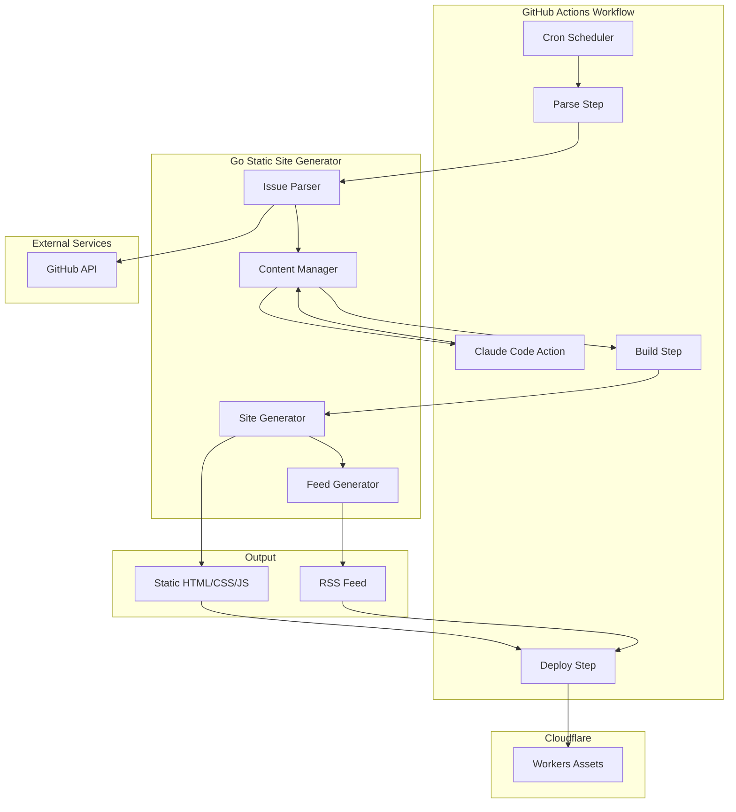
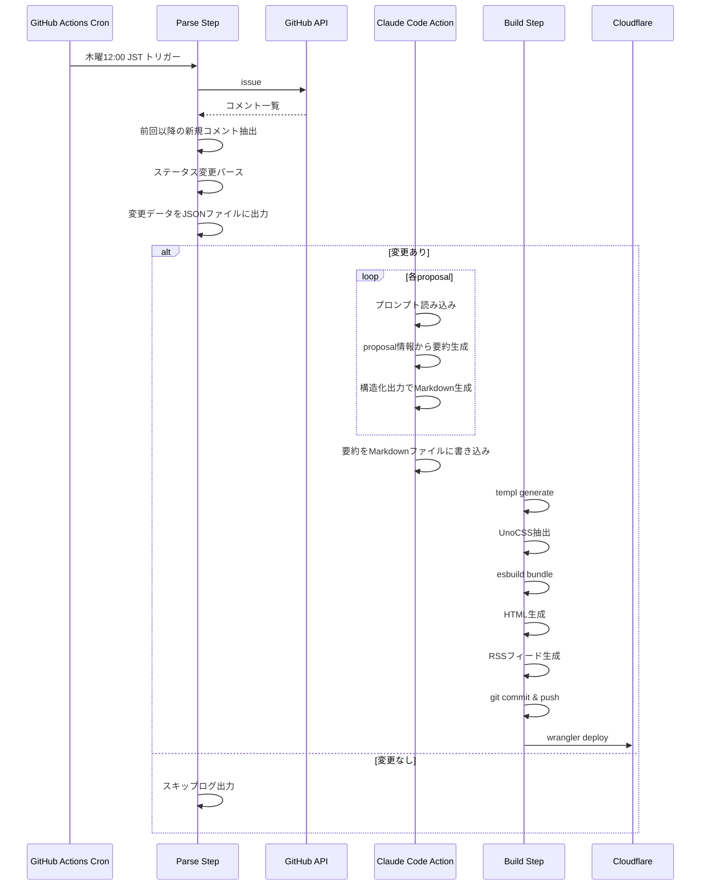
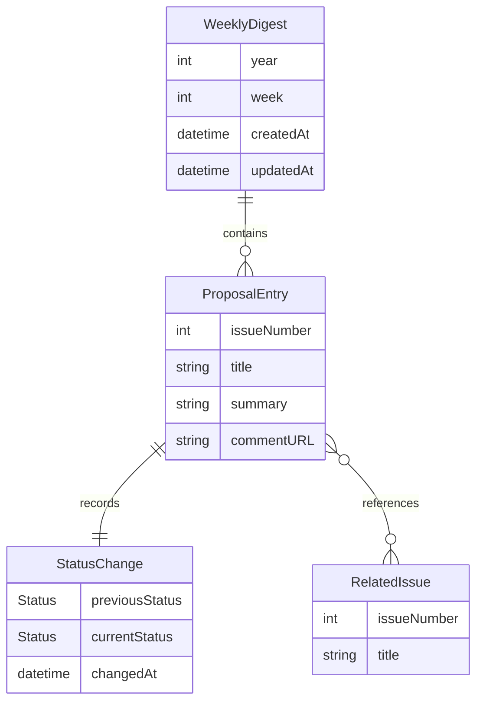

# Design Document: Go Proposal Weekly Digest

## Overview

**Purpose**: Go言語のproposal review meeting minutesを自動解析し、週次のステータス変更を日本語で要約した静的Webサイトを生成・配信するシステム。

**Users**: Goコミュニティの開発者、proposal動向をフォローしたい技術者が、週次更新ページとRSSフィードを通じて最新のproposal状況を把握する。

**Impact**: 手動でissue #33502を追跡する必要がなくなり、日本語での要約により技術的背景の理解が容易になる。

### Goals
- GitHub issue #33502のコメントから自動的にproposalステータス変更を検出
- 変更ごとにAI要約を生成し、日本語で技術的背景を説明
- 毎週木曜日12:00 JSTに静的サイトを自動更新・デプロイ
- RSS 2.0フィードで更新通知を配信

### Non-Goals
- リアルタイム更新（週次バッチ処理で十分）
- proposal内容の詳細分析（ステータス変更の要約に限定）
- 多言語対応（日本語のみ）
- ユーザー認証・コメント機能

## Architecture

### Architecture Pattern & Boundary Map



**Architecture Integration**:
- **Selected pattern**: Workflow-Driven Pipeline - GitHub Actionsワークフロー内で各ステップを順次実行
- **Domain boundaries**: Parse / Summary (Claude Code Action) / Site Generation の3フェーズで責務分離
- **New components rationale**:
  - Issue Parser: GitHub APIとの通信とMinutesフォーマットのパースを専任
  - Claude Code Action: ワークフロー内で要約生成を実行、構造化出力でMarkdownを取得
  - Site Generator: templ + UnoCSS + esbuildのビルドパイプラインを統合

### Technology Stack

| Layer | Choice / Version | Role in Feature | Notes |
|-------|------------------|-----------------|-------|
| Backend | Go 1.22+ | 静的サイトジェネレータ本体 | templ依存 |
| Template | templ v0.3+ | HTMLテンプレート生成 | 型安全なコンポーネント |
| CSS | UnoCSS 0.60+ | ユーティリティCSS生成 | CLI extractor使用 |
| Components | Lit 3.x | 動的UIコンポーネント | esbuildでバンドル |
| Bundler | esbuild 0.24+ | JS/TSバンドル | splitting有効 |
| RSS | gopherlibs/feedhub | RSS 2.0フィード生成 | gorilla/feedsのfork |
| AI | claude-code-action | AI要約生成 | GitHub Actions統合、構造化出力 |
| Deploy | Cloudflare Workers Assets | 静的ファイルホスティング | wrangler v4 |
| CI/CD | GitHub Actions | 定期実行・デプロイ | 全パイプラインを統合 |

## System Flows

### 週次更新フロー



**Key Decisions**:
- 変更がない場合はデプロイをスキップし、不要なコミットを防ぐ
- Claude Code Actionは各proposalを逐次処理（構造化出力で安定した結果を取得）
- パース結果はJSONファイルで次ステップへ受け渡し
- デプロイ失敗時はワークフローを失敗させ、通知を送信

## Requirements Traceability

| Requirement | Summary | Components | Interfaces | Flows |
|-------------|---------|------------|------------|-------|
| 1.1 | issue #33502コメント取得 | IssueParser | GitHubClient | 週次更新 |
| 1.2 | 新規コメント識別 | IssueParser, StateManager | StateStore | 週次更新 |
| 1.3 | ステータス抽出 | MinutesParser | ProposalChange | 週次更新 |
| 1.4 | 変更記録 | ContentManager | WeeklyContent | 週次更新 |
| 1.5 | エラーログ記録 | IssueParser | Logger | - |
| 2.1 | 週次ディレクトリ作成 | ContentManager | FileSystem | 週次更新 |
| 2.2 | proposal別MDファイル生成 | ContentManager | ProposalContent | 週次更新 |
| 2.3 | MDメタデータ | ContentManager | ProposalContent | - |
| 2.4 | 差分マージ | ContentManager | - | - |
| 2.5 | 履歴保持 | ContentManager | - | - |
| 3.1 | Claude Code Action呼び出し | ClaudeCodeAction | WorkflowStep | 週次更新 |
| 3.2 | 日本語説明生成 | ClaudeCodeAction | PromptTemplate | 週次更新 |
| 3.3 | 関連リンク含める | ClaudeCodeAction | StructuredOutput | - |
| 3.4 | フォールバック | ContentManager | - | - |
| 3.5 | 文字数制限 | ClaudeCodeAction | PromptTemplate | - |
| 4.1 | HTML生成 | SiteGenerator | TemplRenderer | 週次更新 |
| 4.2 | ステータス視覚化 | SiteGenerator | StatusBadge | - |
| 4.3 | ページ生成 | SiteGenerator | PageBuilder | 週次更新 |
| 4.4 | UnoCSS適用 | SiteGenerator | StyleBuilder | 週次更新 |
| 4.5 | Lit埋め込み | SiteGenerator | ComponentBundle | - |
| 4.6 | esbuildバンドル | SiteGenerator | Bundler | 週次更新 |
| 5.1 | RSS生成 | FeedGenerator | FeedBuilder | 週次更新 |
| 5.2 | 週次アイテム | FeedGenerator | FeedItem | - |
| 5.3 | フィード内容 | FeedGenerator | - | - |
| 5.4 | autodiscovery | SiteGenerator | - | - |
| 5.5 | 20件制限 | FeedGenerator | - | - |
| 6.1 | cron実行 | GitHubActions | Workflow | 週次更新 |
| 6.2 | 再生成 | GitHubActions | Workflow | 週次更新 |
| 6.3 | コミット | GitHubActions | - | 週次更新 |
| 6.4 | 本番デプロイ | DeploymentPipeline | Wrangler | 週次更新 |
| 6.5 | プレビューデプロイ | DeploymentPipeline | Wrangler | PR時 |
| 6.6 | エラー通知 | GitHubActions | - | - |
| 7.1 | HTML差分計算 | DiffGenerator | DiffCalculator | PR時 |
| 7.2 | PRコメント投稿 | DiffGenerator | GitHubClient | PR時 |
| 7.3 | ページ一覧表示 | DiffGenerator | - | - |
| 7.4 | 差分要約 | DiffGenerator | - | - |

## Components and Interfaces

| Component | Domain/Layer | Intent | Req Coverage | Key Dependencies | Contracts |
|-----------|--------------|--------|--------------|------------------|-----------|
| IssueParser | Parser | GitHub issueからproposal変更を抽出 | 1.1-1.5 | GitHubClient (P0) | Service |
| MinutesParser | Parser | Minutesフォーマットをパース | 1.3 | - | Service |
| StateManager | Parser | 最終処理状態を管理 | 1.2 | FileSystem (P1) | State |
| ContentManager | Content | 週次コンテンツを生成・管理 | 2.1-2.5 | FileSystem (P0) | Service |
| ClaudeCodeAction | Workflow | AI要約を生成 | 3.1-3.5 | GitHub Actions (P0) | Batch |
| SiteGenerator | Site | 静的HTML/CSS/JSを生成 | 4.1-4.6 | TemplRenderer (P0), Bundler (P1) | Service, Batch |
| FeedGenerator | Site | RSSフィードを生成 | 5.1-5.5 | FeedBuilder (P1) | Service |
| DiffGenerator | CI | PR時のHTML差分を計算 | 7.1-7.4 | GitHubClient (P0) | Batch |

### Parser Domain

#### IssueParser

| Field | Detail |
|-------|--------|
| Intent | GitHub issue #33502のコメントを取得し、proposal変更を抽出する |
| Requirements | 1.1, 1.2, 1.3, 1.4, 1.5 |

**Responsibilities & Constraints**
- GitHub APIを介してissueコメントを取得
- StateManagerから前回処理日時を取得し、新規コメントのみを処理
- MinutesParserを呼び出してステータス変更を抽出
- 変更データをJSONファイル（changes.json）に出力し、後続ステップへ渡す
- エラー発生時はログ記録し、処理を継続可能な状態を維持

**Dependencies**
- Outbound: GitHubClient - issue コメント取得 (P0)
- Outbound: MinutesParser - コメントパース (P0)
- Outbound: StateManager - 状態読み書き (P1)

**Contracts**: Service [x]

##### Service Interface
```go
type IssueParser interface {
    // FetchChanges は前回以降のproposal変更を取得する
    FetchChanges(ctx context.Context) ([]ProposalChange, error)

    // WriteChangesJSON は変更データをJSONファイルに出力する
    WriteChangesJSON(changes []ProposalChange, path string) error
}

type ProposalChange struct {
    IssueNumber   int       `json:"issue_number"`
    Title         string    `json:"title"`
    PreviousStatus Status   `json:"previous_status"`
    CurrentStatus  Status   `json:"current_status"`
    ChangedAt     time.Time `json:"changed_at"`
    CommentURL    string    `json:"comment_url"`
    RelatedIssues []int     `json:"related_issues"`
}

type Status string

const (
    StatusDiscussions  Status = "discussions"
    StatusLikelyAccept Status = "likely_accept"
    StatusLikelyDecline Status = "likely_decline"
    StatusAccepted     Status = "accepted"
    StatusDeclined     Status = "declined"
    StatusHold         Status = "hold"
    StatusActive       Status = "active"
)
```

**Implementation Notes**
- Integration: GitHub REST API v3を使用、ETAGキャッシュでレート制限対策
- Validation: コメント日時でフィルタリング、フォーマット不一致は警告ログで継続
- Risks: Minutesフォーマット変更時はパーサー更新が必要

#### MinutesParser

| Field | Detail |
|-------|--------|
| Intent | Proposal review minutesのテキストからステータス変更を抽出する |
| Requirements | 1.3 |

**Responsibilities & Constraints**
- 正規表現ベースでMinutesフォーマットをパース
- ステータスキーワード（accepted、declined、hold等）を検出
- 日付ヘッダーから変更日を抽出

**Dependencies**
- Inbound: IssueParser - パース依頼 (P0)

**Contracts**: Service [x]

##### Service Interface
```go
type MinutesParser interface {
    // Parse はMinutesコメントからproposal変更を抽出する
    Parse(comment string, commentedAt time.Time) ([]ProposalChange, error)
}
```

### Content Domain

#### ContentManager

| Field | Detail |
|-------|--------|
| Intent | 週次コンテンツの生成と管理を行う |
| Requirements | 2.1, 2.2, 2.3, 2.4, 2.5 |

**Responsibilities & Constraints**
- 週ごとのディレクトリ構造（content/YYYY/WXX/）を管理
- 各proposalのMarkdownファイルを生成
- Claude Code Actionが生成した要約をMarkdownに統合
- 既存コンテンツとのマージ処理
- AI要約が失敗した場合のフォールバックテキストを提供

**Dependencies**
- Inbound: IssueParser - 変更データ受け取り (P0)
- Inbound: ClaudeCodeAction - 要約データ受け取り (P0)
- Outbound: FileSystem - ファイル読み書き (P1)

**Contracts**: Service [x]

##### Service Interface
```go
type ContentManager interface {
    // PrepareContent は変更データからコンテンツ雛形を作成する
    PrepareContent(ctx context.Context, changes []ProposalChange) (*WeeklyContent, error)

    // IntegrateSummaries はAI生成要約をコンテンツに統合する
    IntegrateSummaries(content *WeeklyContent, summaries map[int]string) error

    // ApplyFallback は要約がない場合にフォールバックテキストを適用する
    ApplyFallback(content *WeeklyContent) error
}

type WeeklyContent struct {
    Year      int
    Week      int
    Proposals []ProposalContent
    CreatedAt time.Time
}

type ProposalContent struct {
    IssueNumber int
    Title       string
    Status      Status
    Summary     string
    Links       []Link
    ChangedAt   time.Time
}

type Link struct {
    Title string
    URL   string
}
```

### Workflow Domain

#### ClaudeCodeAction

| Field | Detail |
|-------|--------|
| Intent | GitHub Actions内でClaude Code Actionを使用してproposal変更の日本語要約を生成する |
| Requirements | 3.1, 3.2, 3.3, 3.4, 3.5 |

**Responsibilities & Constraints**
- GitHub Actionsワークフローステップとして実行
- 変更データ（changes.json）を読み込み、各proposalの要約を生成
- 構造化出力でMarkdown形式の要約を取得
- 200-500文字の日本語要約を生成するようプロンプトで制御
- 出力は要約ファイル（summaries/NNNNN.md）として保存

**Dependencies**
- Inbound: ParseStep - changes.json (P0)
- Outbound: ContentManager - 要約ファイル (P0)

**Contracts**: Batch [x]

##### Batch / Job Contract
- Trigger: Parse Stepの完了、changes.jsonが存在する場合
- Input: changes.json（ProposalChange配列）
- Output: summaries/ディレクトリに各proposalの要約Markdownファイル
- Idempotency: 同一入力に対して再実行可能、出力は上書き

##### Workflow Step Definition
```yaml
- name: Generate Summaries with Claude
  uses: anthropics/claude-code-action@v1
  with:
    prompt: |
      以下のGo proposalのステータス変更について、日本語で200-500文字程度の要約を生成してください。

      ## 入力データ
      ${{ steps.parse.outputs.changes }}

      ## 出力形式
      各proposalについて、以下の形式でMarkdownファイルを生成してください：
      - ファイル名: summaries/{issue_number}.md
      - 内容: ステータス変更の理由と技術的背景の説明

      関連するGitHub issueへのリンクも含めてください。
    model: claude-sonnet-4-5-20250514
    output_format: structured
```

**Implementation Notes**
- Integration: anthropics/claude-code-action@v1を使用
- Validation: 出力長は500文字を超える場合、プロンプトで再度制限を指示
- Risks: Action実行失敗時はワークフロー継続、フォールバックテキストを使用

### Site Domain

#### SiteGenerator

| Field | Detail |
|-------|--------|
| Intent | 静的HTML/CSS/JSファイルを生成する |
| Requirements | 4.1, 4.2, 4.3, 4.4, 4.5, 4.6 |

**Responsibilities & Constraints**
- templテンプレートからHTMLを生成
- UnoCSS CLIでCSSを抽出
- esbuildでLitコンポーネントをバンドル
- インデックスページと個別ページを出力

**Dependencies**
- Inbound: ContentManager - コンテンツデータ (P0)
- Outbound: TemplRenderer - HTML生成 (P0)
- Outbound: Bundler - JS/CSSバンドル (P1)

**Contracts**: Service [x], Batch [x]

##### Service Interface
```go
type SiteGenerator interface {
    // Generate は静的サイトを生成する
    Generate(ctx context.Context, content *WeeklyContent) error
}
```

##### Batch / Job Contract
- Trigger: ContentManager からのコンテンツ準備完了通知
- Input: WeeklyContent 構造体、過去コンテンツ一覧
- Output: dist/ ディレクトリ配下に HTML/CSS/JS ファイル
- Idempotency: 同一コンテンツに対して再実行可能、出力は上書き

#### FeedGenerator

| Field | Detail |
|-------|--------|
| Intent | RSS 2.0フィードを生成する |
| Requirements | 5.1, 5.2, 5.3, 5.4, 5.5 |

**Responsibilities & Constraints**
- gopherlibs/feedhubでRSS 2.0フィードを構築
- 最新20件の週次更新をアイテムとして含める
- フィードURLをHTMLのautodiscoveryタグに設定

**Dependencies**
- Inbound: SiteGenerator - フィード生成依頼 (P0)
- Outbound: FeedBuilder - RSS構築 (P1)

**Contracts**: Service [x]

##### Service Interface
```go
type FeedGenerator interface {
    // GenerateFeed はRSSフィードを生成する
    GenerateFeed(ctx context.Context, weeks []WeeklyContent) ([]byte, error)
}
```

### CI Domain

#### DiffGenerator

| Field | Detail |
|-------|--------|
| Intent | PR時にHTML差分を計算しコメントで報告する |
| Requirements | 7.1, 7.2, 7.3, 7.4 |

**Responsibilities & Constraints**
- mainブランチとの静的ファイル差分を計算
- 追加・削除・変更ファイル一覧を生成
- PR コメントとして差分サマリーを投稿
- 差分が大きい場合は主要変更点のみ表示

**Dependencies**
- Outbound: GitHubClient - PRコメント投稿 (P0)

**Contracts**: Batch [x]

##### Batch / Job Contract
- Trigger: PR作成・更新イベント
- Input: PRのhead/baseコミット
- Output: PRコメントに差分サマリー
- Idempotency: 既存コメントを更新（新規作成ではなく）

## Data Models

### Domain Model



**Aggregates**:
- WeeklyDigest: 週次ダイジェストのルートエンティティ
- ProposalEntry: 個別proposalの変更記録

**Business Rules**:
- 1週間に複数回の更新があった場合、同一ProposalEntryに最新ステータスを反映
- StatusChangeの履歴は保持せず、最終状態のみ記録

### Logical Data Model

**Structure Definition**:

```yaml
# content/YYYY/WXX/proposal-NNNNN.md
---
issue_number: 12345
title: "proposal: add new feature"
previous_status: discussions
current_status: accepted
changed_at: 2026-01-30T12:00:00Z
comment_url: https://github.com/golang/go/issues/33502#issuecomment-xxx
related_issues:
  - number: 67890
    title: "related discussion"
---

## 要約

この proposal は...（AI生成要約）

## 関連リンク

- [proposal issue](https://github.com/golang/go/issues/12345)
- [review comment](https://github.com/golang/go/issues/33502#issuecomment-xxx)
```

**Intermediate Data**:

```json
// changes.json - Parse StepからClaude Code Actionへの受け渡し
{
  "week": "2026-W05",
  "changes": [
    {
      "issue_number": 12345,
      "title": "proposal: add new feature",
      "previous_status": "discussions",
      "current_status": "accepted",
      "changed_at": "2026-01-30T12:00:00Z",
      "comment_url": "https://github.com/golang/go/issues/33502#issuecomment-xxx"
    }
  ]
}
```

**Consistency**:
- 週次ディレクトリ単位でatomicに更新
- 過去週のコンテンツは変更不可（immutable）

### Physical Data Model

**File Structure**:
```
content/
├── 2026/
│   ├── W05/
│   │   ├── proposal-12345.md
│   │   ├── proposal-67890.md
│   │   └── index.md
│   └── W06/
│       └── ...
├── state.json
└── changes.json          # ワークフロー実行時の一時ファイル

summaries/                 # Claude Code Action出力
├── 12345.md
└── 67890.md

dist/
├── index.html
├── 2026/
│   ├── w05/
│   │   ├── index.html
│   │   ├── 12345.html
│   │   └── 67890.html
│   └── w06/
│       └── ...
├── feed.xml
├── styles.css
└── components.js
```

**state.json**:
```json
{
  "lastProcessedAt": "2026-01-30T03:00:00Z",
  "lastCommentId": "issuecomment-1234567890"
}
```

## Error Handling

### Error Strategy
- Fail Fast: 設定不備やAPI認証エラーは即座に失敗
- Graceful Degradation: 個別proposal処理失敗時は他を継続
- Retry: 一時的なネットワークエラーはexponential backoff

### Error Categories and Responses
**User Errors (4xx)**: 静的サイトのため該当なし
**System Errors (5xx)**:
- GitHub API障害 → 次回実行まで待機、エラーログ記録
- Claude Code Action失敗 → フォールバックテキストで継続、ワークフローは成功扱い
- Cloudflareデプロイ失敗 → GitHub Actions失敗、Slack通知
**Business Logic Errors (422)**:
- Minutesフォーマット不一致 → 警告ログ、スキップして継続

### Monitoring
- GitHub Actions実行ログ
- エラー発生時のSlack/Discord通知（Webhook）
- Cloudflare Analyticsでアクセス状況監視

## Testing Strategy

### Unit Tests
- MinutesParser: 各ステータスパターンのパース検証
- ContentManager: フォールバック処理、要約統合
- FeedGenerator: RSS 2.0フォーマット準拠
- StateManager: 状態読み書き、初回実行時の挙動

### Integration Tests
- IssueParser + GitHub API: モックサーバーでコメント取得フロー
- ContentManager: 要約ファイル読み込みと統合
- SiteGenerator: templ + UnoCSS + esbuild統合ビルド

### E2E Tests
- 週次更新フロー: モックデータで全パイプライン実行（Claude Code Actionはモック）
- RSS配信: フィード妥当性チェック

### Performance
- 50件のproposal変更を5分以内に処理
- 静的サイト生成は1分以内に完了

## Security Considerations

- **GitHub Token**: リポジトリ読み取り・書き込み権限、Secrets管理
- **Claude Code Action**: GitHub App経由で認証、APIキー不要
- **Cloudflare API Token**: デプロイ権限のみに限定
- **生成コンテンツ**: XSSリスクなし（静的生成、ユーザー入力なし）

## Optional Sections

### Migration Strategy
新規プロジェクトのため移行なし。初回実行時は過去1ヶ月分のMinutesを処理してコンテンツを生成。
